# IlluminaGIS

**Sistema Informativo per la Gestione dell'Illuminazione Pubblica**

IlluminaGIS v1.0.2 · Made with ❤️ in Italia

[-informational)](https://github.com/maxsassano/illuminagis)

---

## 📥 Download

Scarica l'ultima versione dalla pagina [**Releases**](https://github.com/maxsassano/illuminagis/releases).

| Requisito | Dettaglio |
|---|---|
| **Sistema Operativo** | Windows 10 / 11 (64-bit) |
| **Runtime** | .NET 10 Desktop Runtime |
| **WebView2** | Runtime Edge WebView2 (preinstallato su Windows 11) |
| **Spazio disco** | ~500 MB (inclusi DB, foto e backup) |
| **Privilegi** | Nessun admin richiesto (installazione per-utente) |

> ℹ️ L'installer verifica automaticamente i prerequisiti e ti guida al download se mancanti.

---

## ✨ Funzionalità principali

- 🏙️ **Gestione completa punti luce** — pali, cabine, linee, mappe
- ☀️ **Pali fotovoltaici** — rilevamento automatico + calcolo risparmio energetico
- 📊 **Statistiche avanzate** — 6 tab con perdite di carico e conto economico
- 🔧 **Lavori a 5 stati** — assegnazione, consegna, verifica, accettazione
- 💬 **Segnalazioni** — dai Responsabili Tecnici all'Admin con GPS e foto
- 📋 **Preventivi** — con righe e conversione automatica in pali reali
- 📄 **Report PDF / Excel / CSV** — con logo aziendale personalizzabile
- 👥 **Multi-utente** — Admin / Responsabile Tecnico / SuperUser su NAS o PC-server
- 🗺️ **Mappa interattiva** — Leaflet.js con marker colorati per stato
- 💾 **Backup automatico** — all'apertura, chiusura e prima delle operazioni critiche
- 📚 **Manuale Utente** — 110 pagine incluse nell'installazione

---

## 📸 Screenshot

### 🚀 Avvio e Login

| Schermata di benvenuto | Selezione progetto recente |
|---|---|
| 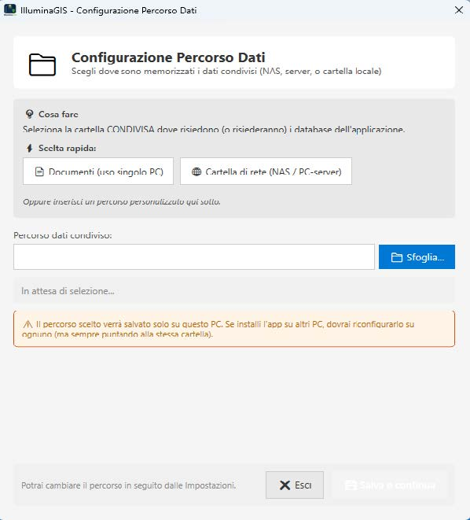 | 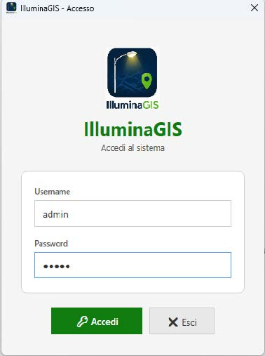 |

| Login | Menu principale |
|---|---|
| 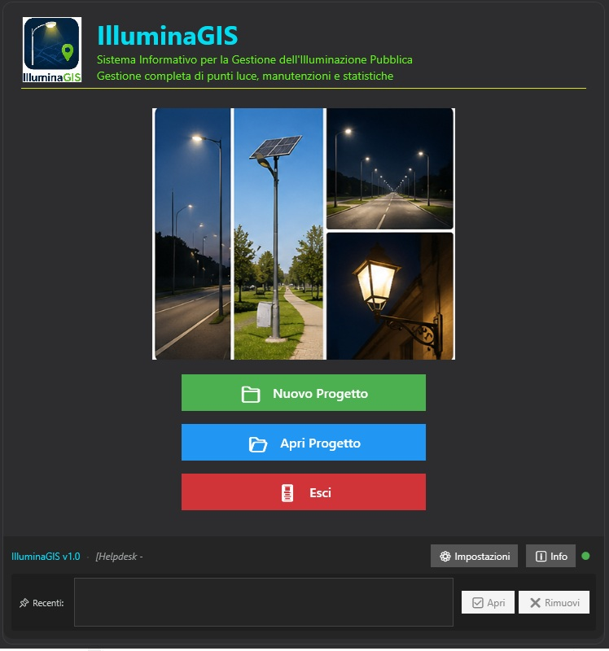 | 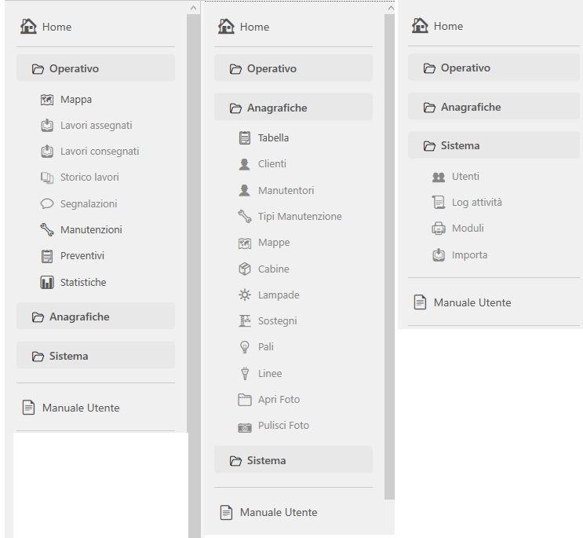 |

### 🏠 Dashboard

| Panoramica Admin | Consultazione unificata |
|---|---|
| 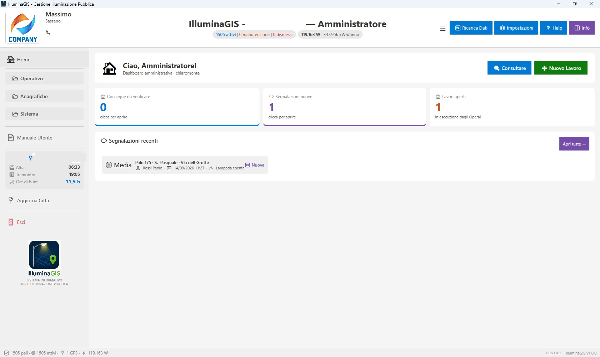 | 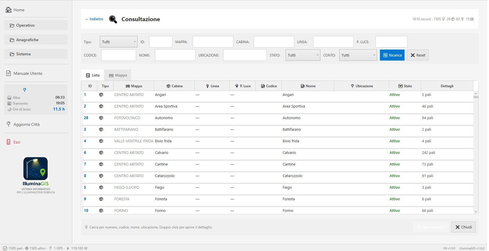 |

### 💡 Dettaglio Palo

| Dati tecnici | Cronologia e manutenzioni |
|---|---|
| 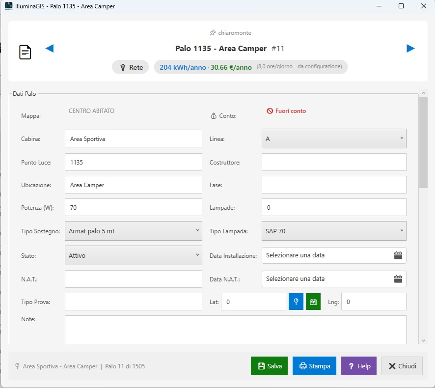 | 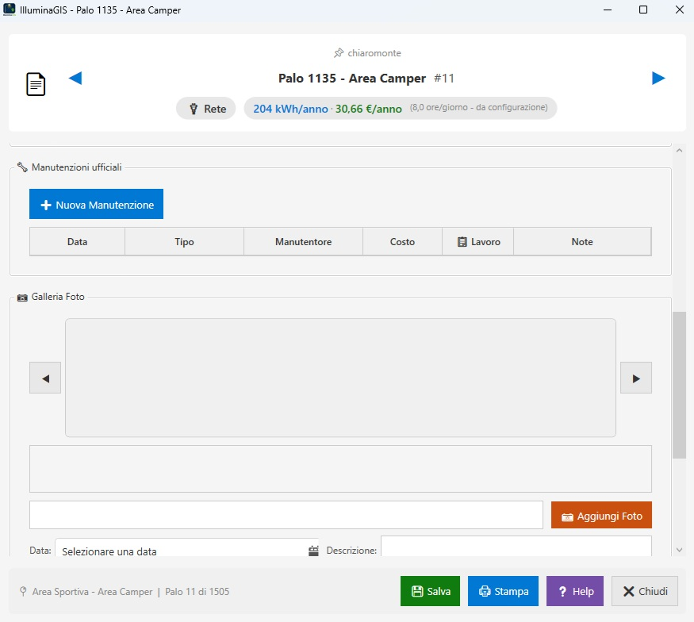 |

### 🗺️ Mappa interattiva

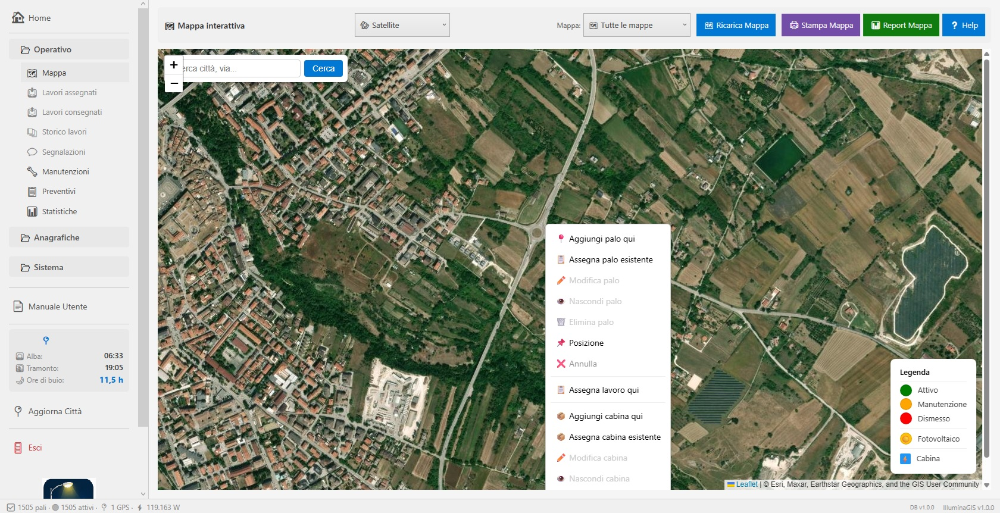

### 📊 Statistiche

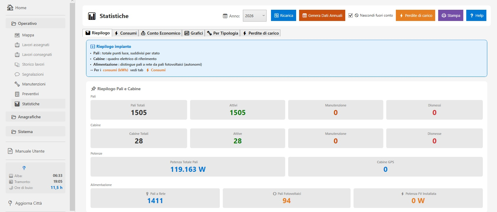

### 🖨️ Moduli di stampa

### ⚙️ Impostazioni Azienda

| Dati azienda | Licenza e generazione dati | Utility database |
|---|---|---|
| 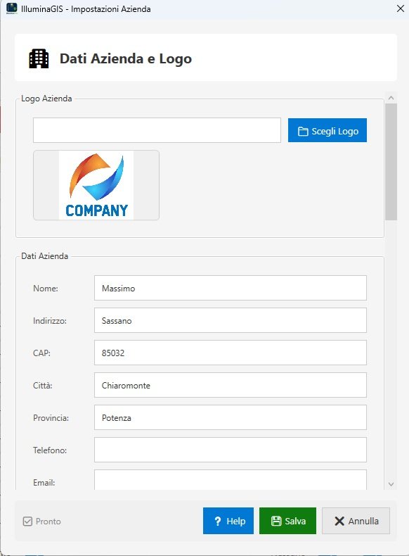 | 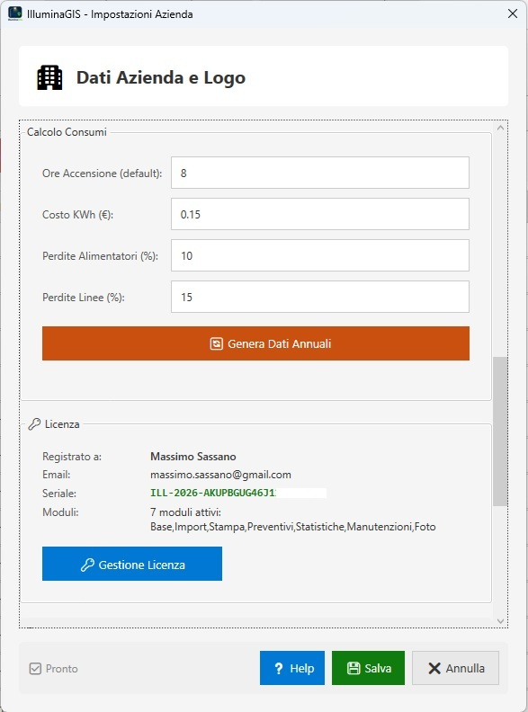 | 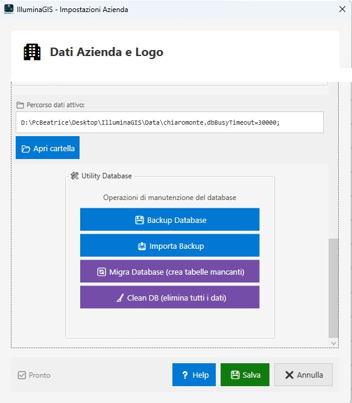 |

---

## 🚀 Installazione

1. **Scarica** il file `IlluminaGIS_Setup_v1.0.2.exe` dalla pagina [**Releases**](https://github.com/maxsassano/illuminagis/releases)
2. **Esegui** l'installer (doppio click — nessun privilegio admin richiesto)
3. **Al primo avvio** configura il percorso dati:
   - Cartella locale (singolo PC)
   - NAS / PC-server (multiutente)
   - ⚠️ **Non usare** OneDrive / Google Drive / Dropbox (rischio corruzione DB)
4. **Attiva la licenza** dal menu **ℹ️ Info → 🔑 Attiva Licenza**
5. **Configura l'azienda** in **⚙️ Impostazioni** (dati, logo, costo kWh)
6. **Genera i dati annuali** di ore buio da **Statistiche → 📅 Genera Dati Annuali**

---

## 📚 Documentazione

Il **Manuale Utente** (110 pagine) è incluso nell'installazione:

- 📂 Accessibile dal menu Start → **"Manuale IlluminaGIS"**
- 📄 Oppure dalla cartella: `%LocalAppData%\Programs\IlluminaGIS\Documentazione\`

**Indice dei 25 capitoli:**
Introduzione · Primi Passi · Installazione e Licenza · Interfaccia · Pali · Pali Fotovoltaici · Cabine · Linee · Mappe · Mappa Interattiva · Statistiche · Perdite di Carico · Manutenzioni · Preventivi · Lavori · Segnalazioni · Anagrafiche · Import · Export · Moduli di Stampa · Utenti · Log · Impostazioni · Backup · FAQ

---

## 🔧 Requisiti multiutente

Per uso con più postazioni sulla stessa cartella dati:

- ✅ **NAS** o **PC-server** in rete locale (SMB)
- ✅ Massimo **3-5 utenti** contemporanei con SQLite
- ✅ Configurazione automatica `journal_mode=DELETE` + `synchronous=FULL`
- ❌ **NON usare** cartelle sincronizzate cloud (OneDrive, Drive, Dropbox)

---

## 🆕 Novità v1.0.2

- 🔄 **Refactor nomenclatura**: ruolo "Operaio" rinominato in **"Responsabile Tecnico"** in tutta l'interfaccia (login, menu, Home, gestione utenti, Help)
- ✏️ **Apri scheda / Vedi scheda** — il pulsante nella Home del Responsabile Tecnico cambia automaticamente in base allo stato del lavoro (editabile solo se Assegnato/Rifiutato, sola lettura se Consegnato/Accettato)
- 🖱️ **Doppio click** sullo storico lavori per aprire il dettaglio in sola lettura
- 🗑️ **Soft-delete Lavori e Manutenzioni** (Annulla / Ripristina)
- 👤 **Campo Manutentore** nella scheda lavoro
- 📋 **Protocollo PEC** strutturato e ricercabile (Lavori + Manutenzioni)
- ➕ **Pulsante rapido Manutenzione** in Home Admin
- 🚫 **Gating Responsabile Tecnico** — pulsanti nascosti in Palo/Cabina
- 🔍 **Filtro Stato** nello storico lavori del Responsabile Tecnico
- 🧹 **Clean DB**: eliminazione definitiva righe annullate
- ⚡ Ottimizzazione gestione foto in NuovaManutenzioneWindow
- 🐛 **Fix** pulsante "Nuovo Progetto" in StartupWindow
- 🐛 Bugfix vari

---

## 🆘 Supporto

Per **bug**, **suggerimenti** o **richieste di funzionalità**:

👉 Apri una nuova [**Issue su GitHub**](https://github.com/maxsassano/illuminagis/issues)

---

## 📄 Licenza

**Software proprietario** — © 2026 Massimo Sassano. Tutti i diritti riservati.

L'utilizzo è consentito esclusivamente ai soggetti in possesso di regolare licenza d'uso.
La redistribuzione, la decompilazione o la modifica non autorizzata sono vietate.

---

  IlluminaGIS v1.0.2 · Made with ❤️ in Italia

